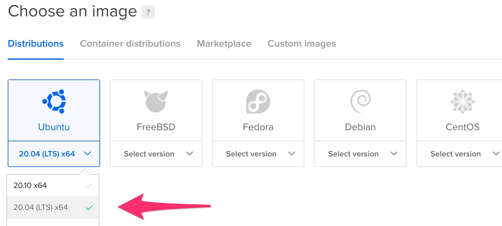
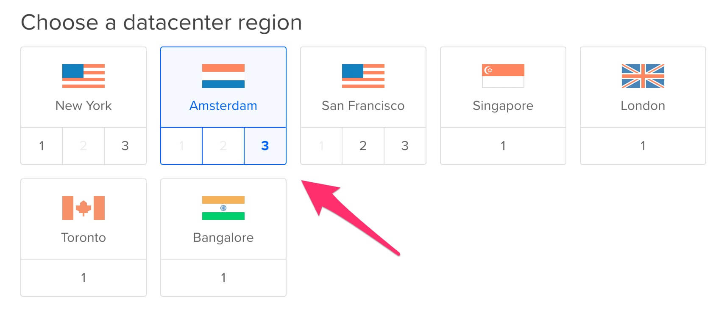
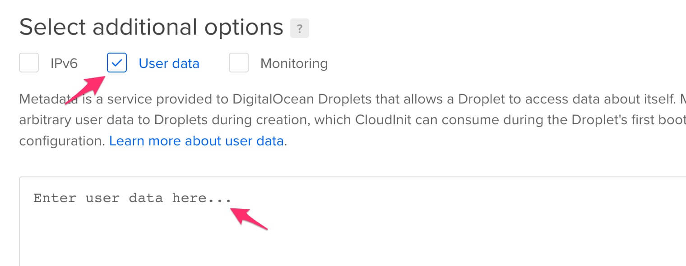
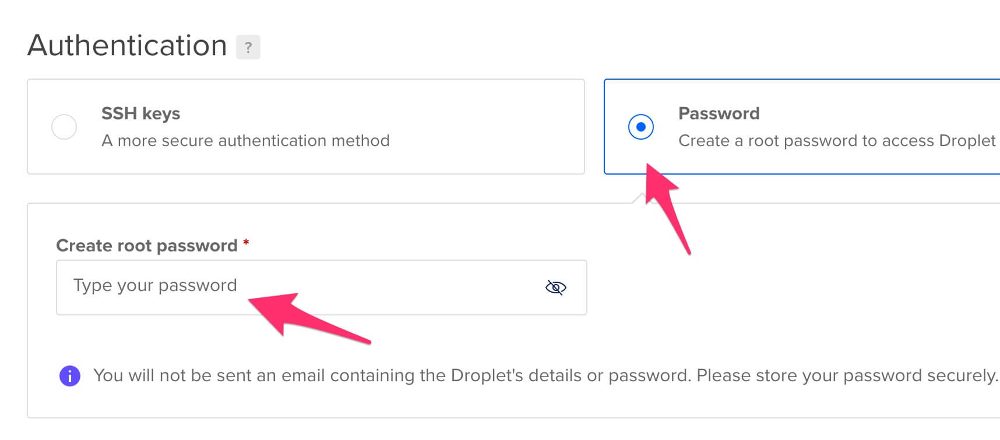

Как выгрузить Ephyr re-streamer на DigitalOcean
===============================================

Это инструкция по основному и рекомендуемому способу выгрузки приложения Ephyr re-streamer на [DigitalOcean] хостинг.


## 0. Перед началом

У Вас должен быть зарегистрированный аккаунт на [DigitalOcean] c [настроенным и действующим способом оплаты][1].


## 1. Создание дроплета

Откройте [страницу создания дроплета][2].


### 1.1. Выберите Ubuntu 20.04 LTS образ



> __ВНИМАНИЕ__: Другие образы не поддерживаются! НЕ выбирайте их!


### 1.2. Выберите желаемую конфигурацию

Для небольших ретрансляций вполне подходит самая дешёвая конфигурация. Но если Вы собираетесь запускать большое количество ретрансляций, то лучше использовать дроплет помощнее.


### 1.3. Выберите регион

Предпочтитайте регион, ближе всего находящийся одновременно ко входящим точкам (откуда берётся оригинальный RTMP поток) и исходящим точкам (куда RTMP поток будет передан).




### 1.4. Вставьте преднастроечный скрипт

Чтобы установить Ephyr re-streamer на новосозданный дроплет, необходимо установить преднастроечный скрипт, который и выполнит установку.

Вставьте текст ниже в `User data` секцию.
```bash
#!/bin/bash
curl -sL https://raw.githubusercontent.com/ALLATRA-IT/ephyr/restreamer-v0.2.0-beta.2/components/restreamer/deploy/provision/ubuntu-20-04-x64.sh | bash -s
```




### 1.5. Настройте SSH доступ

[DigitalOcean] требует, чтобы созданный дроплет был доступен через [SSH].

Это не есть необходимостью для использования Ephyr re-streamer, потому будет достаточно просто указать случайный пароль. Но если Вы знаете зачем Вам [SSH] доступ, то можете указать соответствующий ключ.


### 1.6. Укажите имя дроплета

Укажите дроплету особое имя, дабы потом легко вспомнить зачем он был создан. Или же используйте предоставленное по умолчанию, если Вас это не заботит.




### 1.7. Создайте дроплет

Не используйте бэкапы. Они будут избыточны так как Ephyr re-streamer не хранит каких-либо данных.


## 2. Доступ к Ephyr re-streamer

После запуска процесса создания дроплета подождите от 5 до 15 минут пока дроплет настроится и Ephyr re-streamer установится.


Используйте IP-адрес созданного дроплета для доступа к установленному Ephyr re-streamer (веб-интерфейс может немного отличаться от изображения ниже).


> __ВНИМАНИЕ__: НЕ используйте `https://` в адресной строке браузера. Поддерживается ТОЛЬКО `http://`. 


[DigitalOcean]: https://digitalocean.com
[SSH]: https://ru.wikipedia.org/wiki/SSH

[1]: https://cloud.digitalocean.com/account/billing
[2]: https://cloud.digitalocean.com/droplets/new
