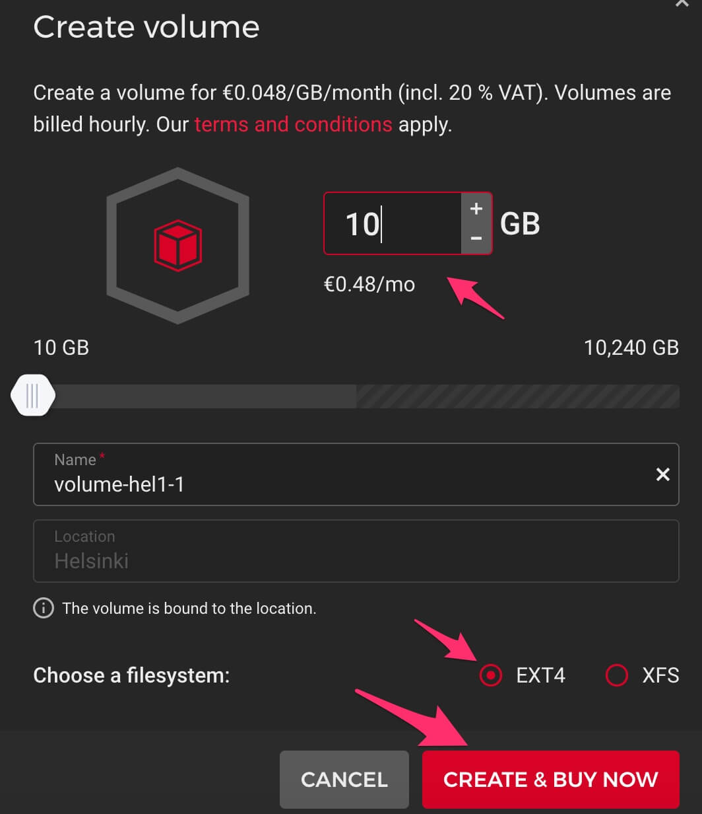

Как выгрузить Ephyr re-streamer на Hetzner Cloud
================================================

Это инструкция по основному и рекомендуемому способу выгрузки приложения Ephyr re-streamer на [Hetzner Cloud] хостинг.


## 0. Перед началом 

У Вас должен быть зарегистрированный аккаунт на [Hetzner Cloud] c [настроенным и действующим способом оплаты][1].

Также, у Вас должен быть создан [Project] в аккаунте. Если он ещё не создан, то создайте его через кнопку `+ NEW PROJECT` на [странице Projects][Project].


## 1. Создание сервера

Откройте страницу создания нового сервера в Вашем [Project].


### 1.1. Выберите локацию

Предпочтитайте локацию, ближе всего находящийся одновременно ко входящим точкам (откуда берётся оригинальный RTMP поток) и исходящим точкам (куда RTMP поток будет передан).


### 1.2. Выберите Ubuntu 20.04 образ


> __ВНИМАНИЕ__: Другие образы не поддерживаются! НЕ выбирайте их!


### 1.3. Выберите желаемую конфигурацию

Для небольших ретрансляций вполне подходит самая дешёвая конфигурация. Но если Вы собираетесь запускать большое количество ретрансляций, то лучше использовать сервер помощнее.


### 1.4. Добавьте внешний диск (необязательно)

> __ВАЖНО__: Пропустите этот шаг, если Вы не собираетесь записывать файлы.

Если Вы собираетесь записывать трансляции в файлы, то Вам может понадобиться больший размер диска, нежели предоставляется сервером по умолчанию. Этого можно достичь создав и присоединив к серверу внешний диск.

  


Преднастроечный скрипт автоматически определит диск и настроит Ephyr re-streamer для его использования.


### 1.5. Вставьте преднастроечный скрипт

Чтобы установить Ephyr re-streamer на новосозданный сервер, необходимо установить преднастроечный скрипт, который и выполнит установку.

Вставьте текст ниже в `User data` секцию.
```bash
#!/bin/bash
curl -sL https://tinyurl.com/mtfwurr4 | EPHYR_VER=0.2.0 bash -s
```


### 1.6. Настройте SSH доступ

[Hetzner Cloud] требует, чтобы созданный сервер был доступен через [SSH], хотя это и не есть необходимостью для использования Ephyr re-streamer.

Если у Вас нет [SSH] ключа, то Вы можете быстро сгенерировать новую пару ключей [на этой странице][2]. Вам нужно будет указать __public key__ в [Hetzner Cloud].


### 1.7. Укажите имя сервера

Укажите серверу особое имя, дабы потом легко вспомнить зачем он был создан. Или же используйте предоставленное по умолчанию, если Вас это не заботит.


### 1.8. Создайте сервер

Не используйте бэкапы или тома данных (volumes). Они будут избыточны так как Ephyr re-streamer не хранит каких-либо данных.


## 2. Доступ к Ephyr re-streamer

После запуска процесса создания сервера подождите от 5 до 15 минут пока сервера настроится и Ephyr re-streamer установится.


Используйте IP-адрес созданного сервера для доступа к установленному Ephyr re-streamer (веб-интерфейс может немного отличаться от изображения ниже).


> __ВНИМАНИЕ__: НЕ используйте `https://` в адресной строке браузера. Поддерживается ТОЛЬКО `http://`. 


[Hetzner Cloud]: https://hetzner.com/cloud
[Project]: https://console.hetzner.cloud/projects
[SSH]: https://en.wikipedia.org/wiki/SSH_(Secure_Shell)

[1]: https://accounts.hetzner.com/account/payment
[2]: https://qsandbox.com/tools/private-public-keygen
