How to deploy Ephyr re-streamer to Oracle Cloud Infrastructure
==============================================================

This guide provides a common and recommended way to deploy Ephyr re-streamer application as a standalone instance on [Oracle Cloud Infrastructure].

This may be an interesting deployment variant, because [Oracle Cloud Infrastructure] provides [Free Tier] instances. However, their bandwidth and resources are quite limited to be used for some serious re-streams.

> __NOTE__: Despite web interface specifies that a bandwidth of [Free Tier] VM instance is limited to 0.5 Gbps, in reality it's limited to 50 Mbps. This should be enough to make up to 8 re-streams with 5000 kbps bitrate.


## 0. Prerequisites

You should have a registered account on [Oracle Cloud Infrastructure]. Beware that the registration process is very sensitive to your data (so be patient with providing it), and may take several days to proceed.


## 1. Create VM instance

Open the "Get Started" page when you're signed-in and choose the "Create a VM instance" action.

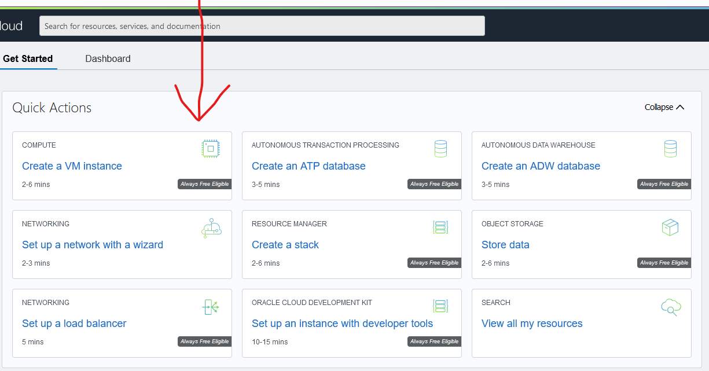


### 1.1. Provide VM instance name

Specify a custom name of the VM instance to not forget its purpose, or just go with a default one if you don't bother about it.

Then customize the VM instance via `Edit` button.

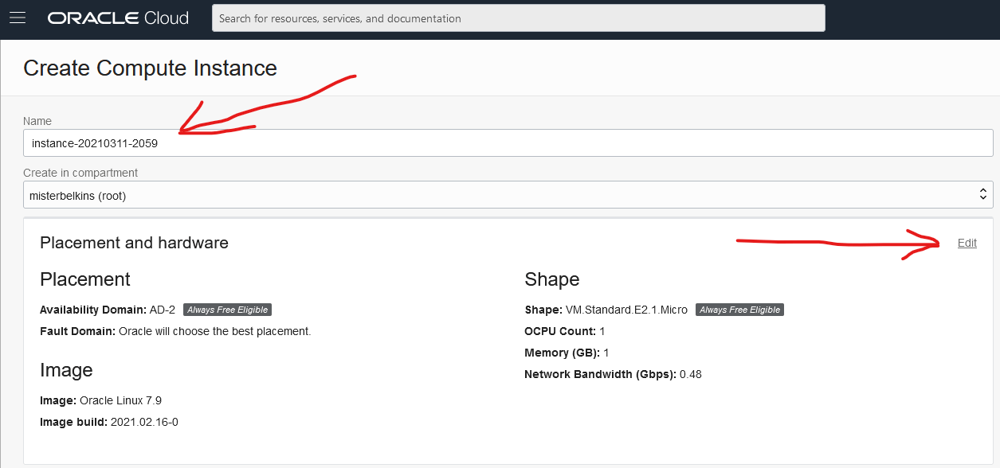


### 1.2. Choose Canonical Ubuntu 20.04 LTS image

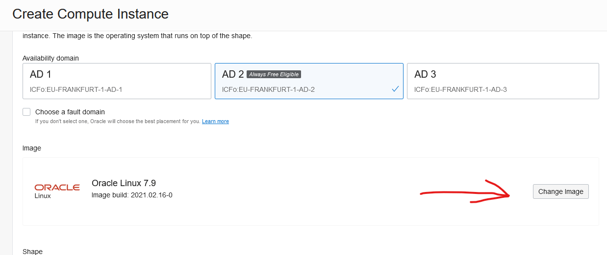
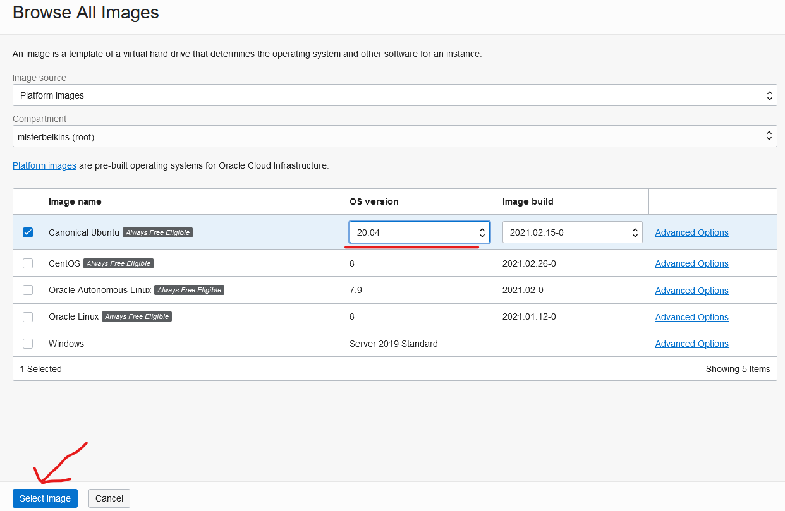

> __WARNING__: Other images are not supported! Do NOT select them!


### 1.3. Choose desired resources

For simple re-streaming the one from [Free Tier] should be enough. But if you're going to run a medium or large amount of re-streams, consider a more performant variant.

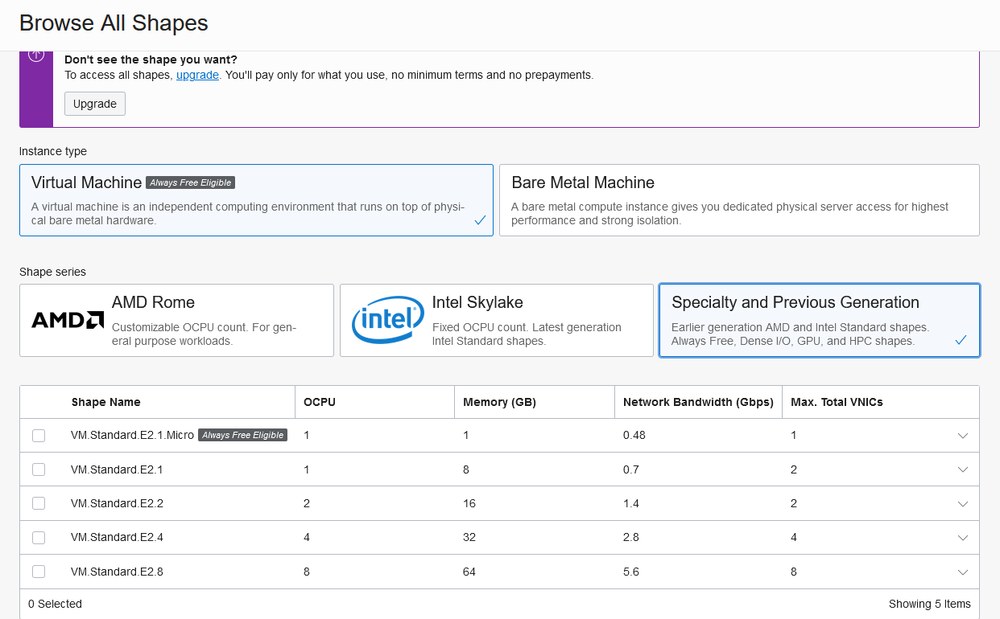


### 1.4. Setup SSH access

You may setup the created VM instance to be accessible via [SSH].

It's not required for using Ephyr re-streamer, so just specify "No SSH keys" option. Or specify/generate an appropriate [SSH] key if you know what you're doing.

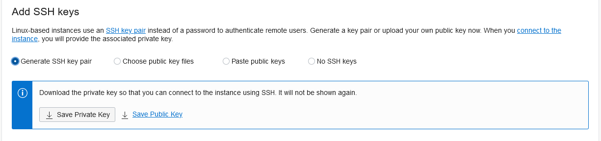


### 1.5. Inject provision script

To install Ephyr re-streamer onto a newly created VM instance, we should specify a provision script for doing that installation job.

Use the "Show advanced options" link.

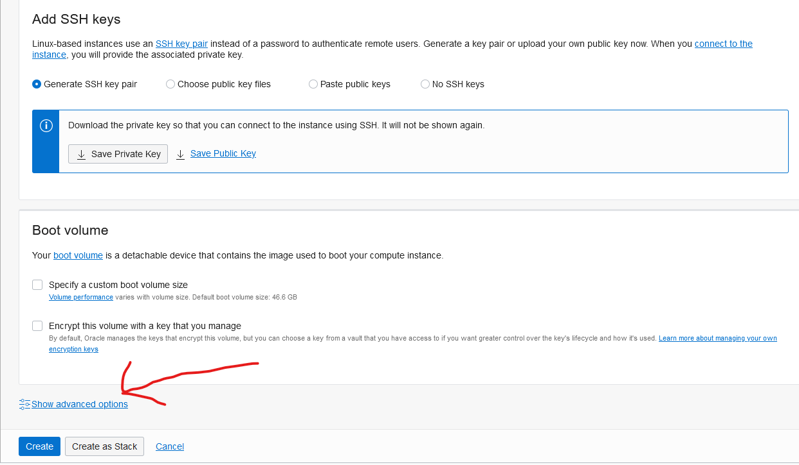

And paste the text below to the `Cloud-init script` section.
```bash
#!/bin/bash
curl -sL https://raw.githubusercontent.com/ALLATRA-IT/ephyr/restreamer-v0.2.0-rc.1/components/restreamer/deploy/provision/ubuntu-20-04-x64.sh | WITH_FIREWALLD=1 bash -s
```

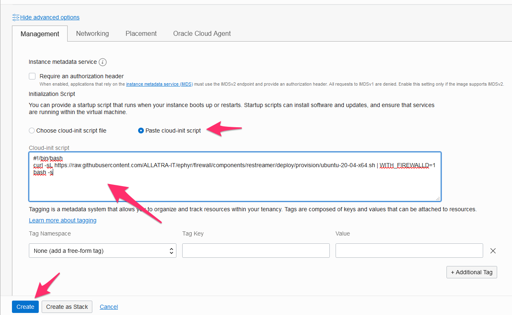

Finally, proceed with a VM instance creation.


## 2. Setup networking

[Oracle Cloud Infrastructure] VM instances require some additional networking setup after creation for Ephyr re-streamer to work well.


### 2.1. Choose Virtual Cloud Network

Go to the "Virtual Cloud Networks" page and choose your existing network.

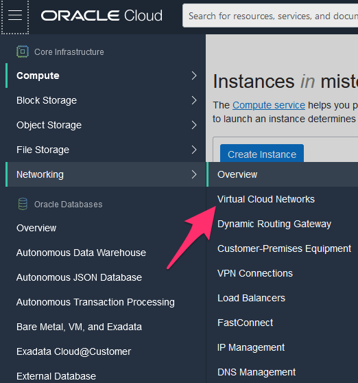
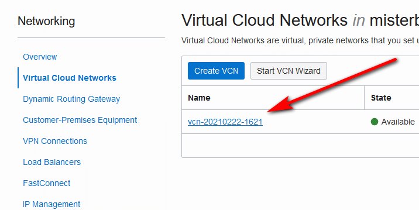


### 2.2. Choose Security List

Navigate to the "Security Lists" tab and choose the Security List of your existing network.

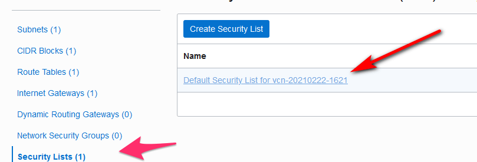


### 2.3. Setup Ingress Rules

Navigate to the "Ingress Rules" tab and remove all the existing rules.

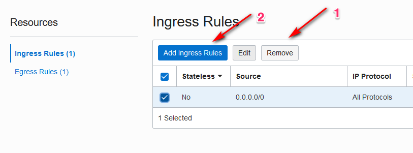

Then create a new rule allowing all IP protocols for `0.0.0.0/0` CIDR.

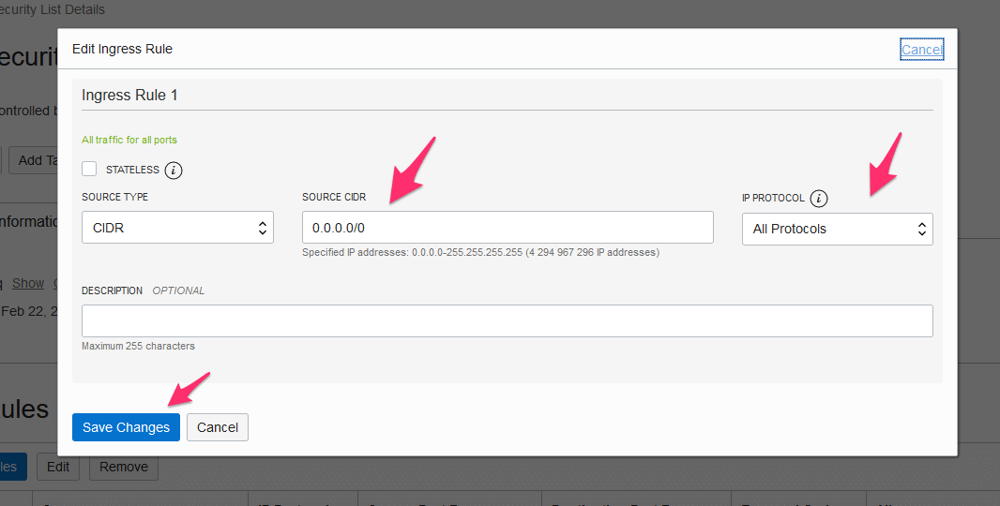


## 3. Access Ephyr re-streamer

After you've launched a VM instance creation and configured its networking, wait from 5 to 15 minutes until it is provisioned and Ephyr re-streamer is installed.

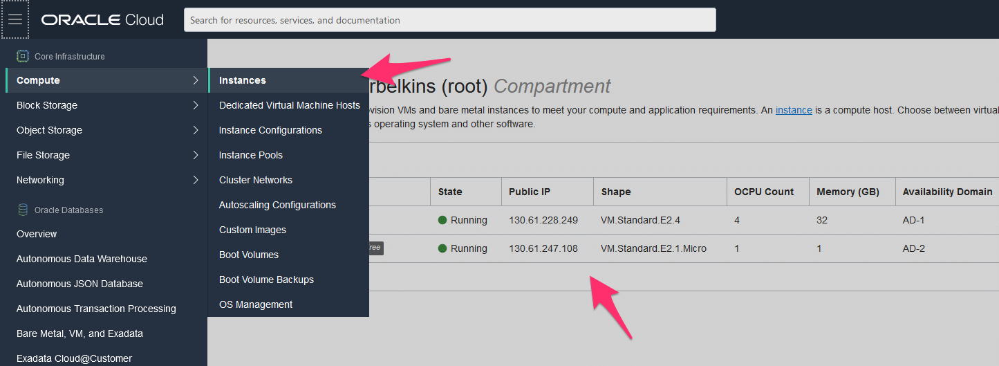

Use IP address of the created VM instance in browser's address bar to access the installed Ephyr re-streamer(Web UI may look a bit different from the picture below).


> __WARNING__: Do NOT use `https://` scheme in browser's address. ONLY `http://` is supported. 


[Free Tier]: https://www.oracle.com/cloud/free
[Oracle Cloud Infrastructure]: https://www.oracle.com/cloud
[SSH]: https://en.wikipedia.org/wiki/SSH_(Secure_Shell)
